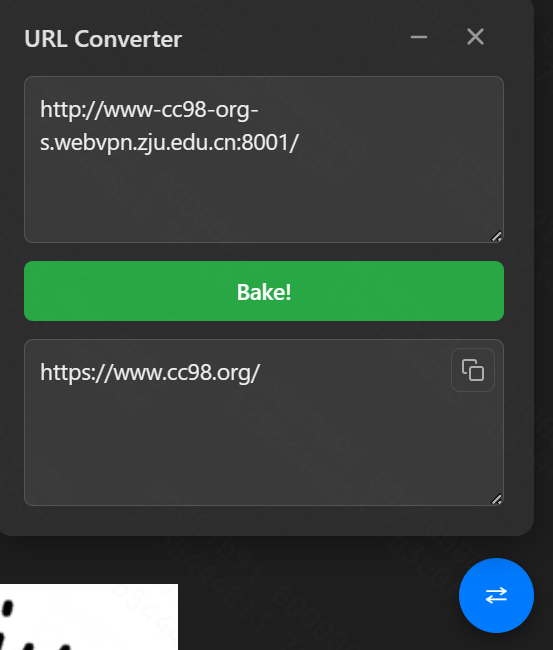
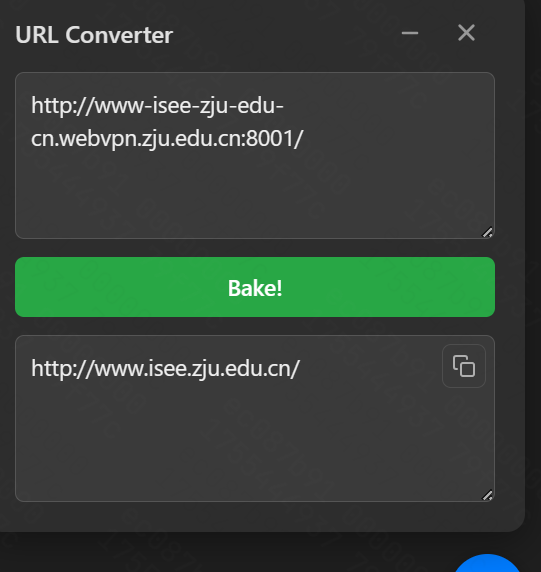

# README

>[!WARNING]
> 下面的截图是旧版WebVPN，效果仅作参考
>

## 功能描述

本脚本适用于[浙江大学WebVPN](https://webvpn.zju.edu.cn/)，提供在WebVPN代理下的链接到一般链接的转换。例如：

转换效果如下图所示：

- https协议：

- http协议：

转换规则可参考[CC98帖子](https://www.cc98.org/topic/6319235)。

## 按键功能

- 转化按钮（右下角蓝色）默认在含有webvpn的页面显示。点击转化按钮，唤起输入页面，输入框右上角可复制网址，文本框右下角可以拖动大小。
- 最小化(-)：收起输入框，留下转化按钮。可再此唤起；
- 关闭(×)：暂时不显示按钮及输入框；若重新唤起需刷新网页。
- UI仅适配系统白天及黑夜模式，手动调节页面的白天及黑夜模式后对插件没有影响。

## Quick Start

- 若您已经安装篡改猴插件，可以戳[这里](https://greasyfork.org/zh-CN/scripts/546176-%E7%BD%91%E5%9D%80-webvpn-%E8%BD%AC%E5%8C%96%E5%B7%A5%E5%85%B7)安装；
- 若您没有安装篡改猴插件，可在插件商店搜索 Tampermonkey、添加到扩展程序，后点击上述链接安装。

## Other

本插件编写比较简陋，欢迎pr；若感觉WebVPN使用不方便，还是推荐使用aTrust及ZJUConnect.

